# Quick Start Guide

**Note: This guide requires Unity 2020.3 and above.**

This page explains how to set up a simple project with localized assets and strings. This covers the following steps:

1. [Create the Localization Settings.](#create-the-localization-settings)
2. [Create locales.](#create-locales)
3. [Choose a default locale.](#choose-a-default-locale)
4. [Localize assets.](#asset-localization)
5. [Localize strings](#localize-strings)
6. [Preview and configure your build.](#preview-and-configure-your-build)

## Create the Localization Settings

The Project's Localization Settings is an Asset. To create this Asset, go to **Edit > Project Settings > Localization** and click **Create**

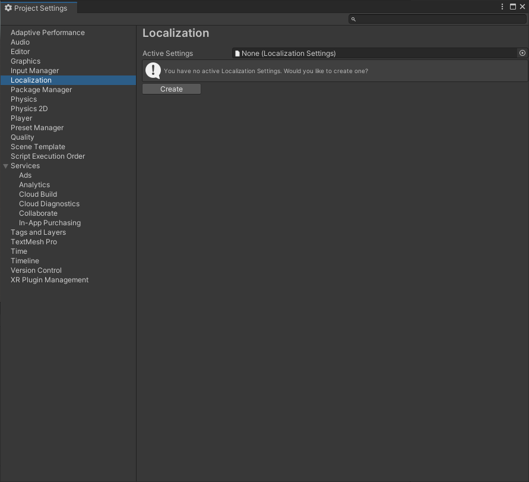

## Create locales

A [locale](Locale.md) represents a language and an optional region; they can also contain additional information, such as currency, calendar, and user-added custom data.

To open the Locale Generator window, navigate to the Localization Settings (menu: **Edit > Project Settings > Localization**) and select **Locale Generator**.

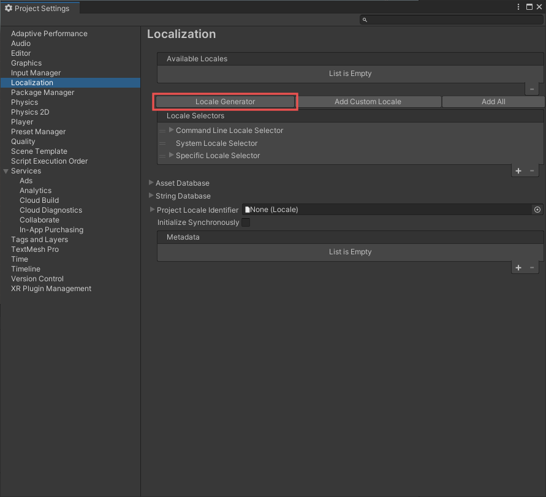

1. Select the checkbox next to the Locales you want to add.
2. Select **Generate Locales**.
3. Select where you want to save the Assets to.
Unity creates an asset file for each locale you select.

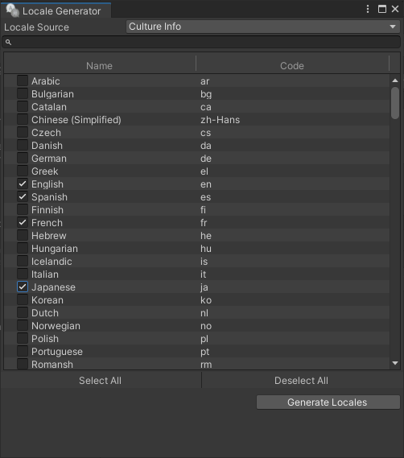

## Choose a default Locale

Use the [Locale Selectors](LocalizationSettings.md#locale-selector) to determine which Locale your application uses by default if it is not English(en). To do this,

1. Select the **Specific Locale Selector** field.
2. Select the Locale Id field’s object picker.
3. Double-click the locale to set as default.

Your application uses this locale on startup, and when no other locale is selected.
You should also set the project locale to the default locale. To do this:

1. Select the **Project Locale Identifier** field’s object picker.
2. Double-click the locale to set as the project locale.

Typically this is the locale that the project is being developed in and is used by the [Localized Property Variants](LocalizedPropertyVariants.md) system.

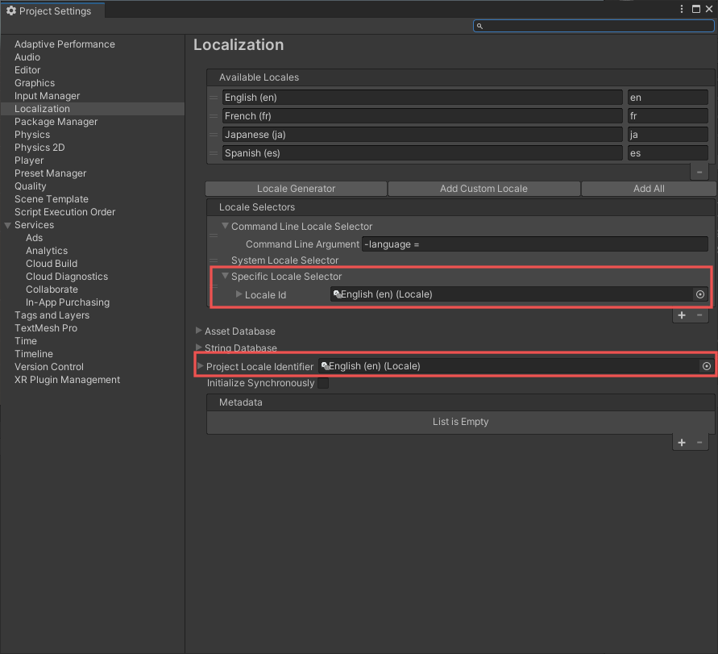

## Asset Localization

There are many reasons you might need to localize an Asset. For example, you might want to play a different piece of voiceover audio or music, or change a texture that contains written text (such as a signpost). The localization system uses [Asset Tables](AssetTables.md) to support this.

This example demonstrates changing an asset's texture to the flag of that locale's country.

### Create The Asset Table Collection

First, you need to create an Asset Table. To do this, open the **Localization Tables Window** (menu: **Window > Asset Management > Localization Tables**).

1. In the Asset Tables window, select the **New Table Collection** tab.
2. Select which locales you want to generate tables for.
3. In the Type dropdown, select **Asset Table Collection**.
4. In the Name field, give the collection a name.
5. Select Create and choose a directory to generate the assets.

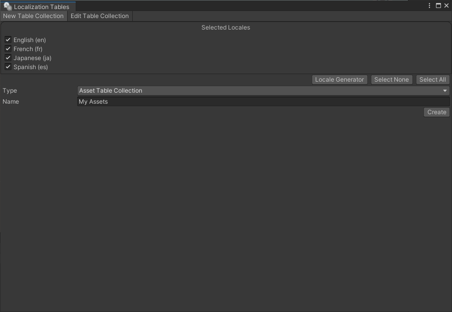

### Localize a sprite

The Localization system allows you to work directly with scene components and will record any changes made directly to a component for the currently active Locale. To do this you will need to first set up the project. Open the **Localization Scene Controls** window (menu: **Window > Asset Management > Localization Scene Controls**).
Set the **Asset Table** field to the table collection that was just created. Any asset changes made now are recorded into the selected Asset Table.

1. In the Asset Table field select your table collection.
2. Any asset changes you make now are recorded into the selected Asset Table.

Unity can access a localized Asset in multiple ways. This example uses the Localized Property Variants system, so you do not need to write any scripts.

1. Add a **UI Image** component to the Scene (menu: **GameObject > UI > Image.**). Note: To add an image, your project must have the [Unity UI](https://docs.unity3d.com/Manual/com.unity.ugui.html) package installed.
2. In the Active Locale field, select English.
3. Enable the **Track Changes** toggle.

    

4. For each locale, change the **Source Image** to use the flag for that locale.

    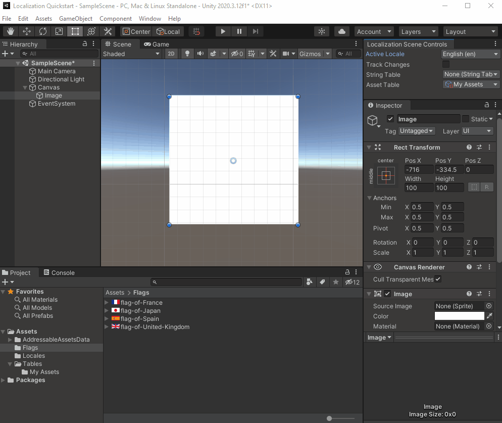

5. Run the Scene and use the Game View Locale selection dropdown to change the **Locale**. If everything is configured correctly, the country flag changes to the assigned sprite in the asset table.

    If the Game View menu does not appear, enable it in the Preferences window (menu: **Edit > Preferences > Localization**)

    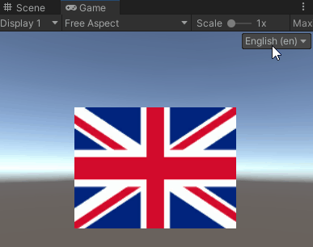

    You can use the **Locale Game View Menu** to quickly change the language in the Editor. You can enable and disable this in **Edit > Preferences > Localization**.

    When you edit the sprite, the image is automatically connected to a localization table entry. The **Game Object Localizer** component that is attached to the same GameObject as the image displays the localization table entry. In the Game Object Localizer component, you can edit the table entry and even connect to a different table entry.

    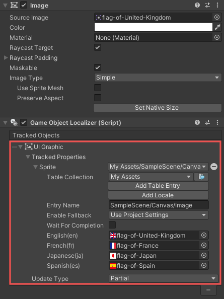

    When you open the Asset Table Collection, the new entry and its associated assets are displayed. You can make changes in the table as well as directly to the Image component and GameObject Localizer.

    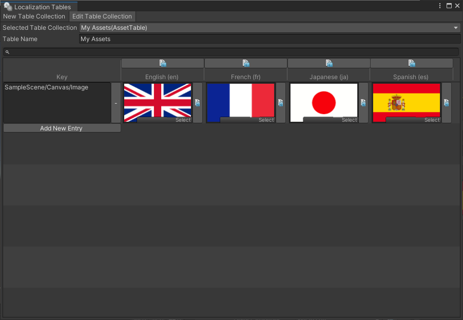

### Localize audio

Not all Unity component types let you directly change the component. In these cases, use component localizers. For further information see [Localized Property Variants](LocalizedPropertyVariants.md).
This example shows how to use component localizers to apply different audio files for different locales.

1. Add an Audio Source GameObject (menu: **GameObject > Audio > Audio Source**).
2. Right-click the Audio Source component and choose **Localize**.

    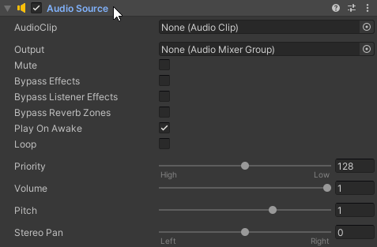

3. In the **Localize Audio Clip Event** component, expand the **Localized Asset Reference** field.
4. In the Table Collection dropdown, select your asset table.
5. Click **Add Table Entry** and change the **Entry Name** to `National Anthem`.
6. Drag and drop the audio clips into the corresponding Locale fields.

    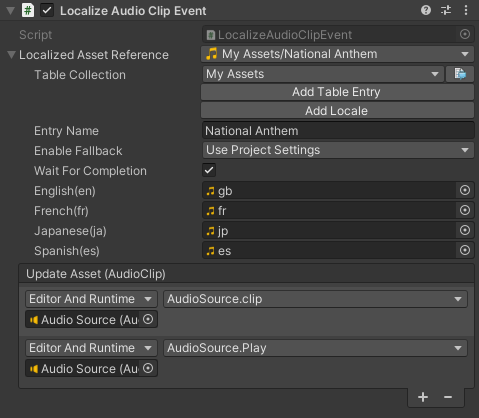

## Localize strings

Strings are one of the most common areas to localize. Strings can either be static, in that the contents never change, or dynamic such as text that changes based on the current game status. The localization system uses [String Tables](StringTables.md) to support both static and dynamic strings.

To localize strings, follow these steps:

1. Create the String Table Collection.
2. Localize the static text.
3. Localize the dynamic text.
4. Use the string table entries.

### Create the String Table Collection

First, you need to create a string table. To do this, open the **Localization Tables Window** (menu: **Window > Asset Management > Localization Tables**).

1. In the Asset Tables window, select the **New Table Collection tab**.
2. Select which Locales you want to generate tables for, choose the **String Table Collection** from the Type dropdown and give the collection a name.
3. Click the Create button and choose a directory to generate the assets.

    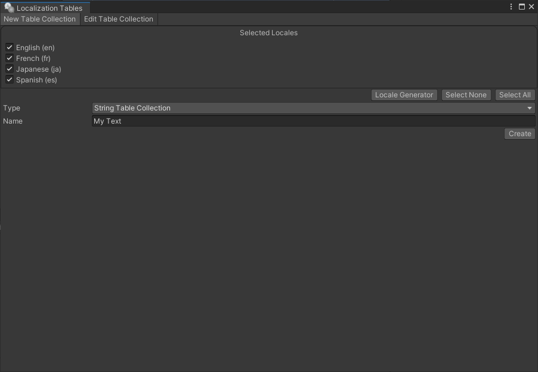

### Localize static text

The Localization system allows you to work directly with scene components and records any changes you make directly to a component for the currently active Locale. To do this you will need to first set up the project. Open the **Localization Scene Controls** window (menu: **Window > Asset Management > Localization Scene Controls**).
Set the **String Table** field to the table collection that was just created. Any string changes made now are recorded into the selected String Table.

Unity can access localized strings in multiple ways. This example uses the **Localized Property Variants** system, so you do not need to write any scripts.

1. Add a **TextMeshPro - Text** component to the scene (menu: **GameObject > UI > Text - TextMeshPro**).
Note: To use TextMeshPro, your project must have the [TextMeshPro](https://docs.unity3d.com/Manual/com.unity.textmeshpro.html) package installed.
2. In the **Active Locale** field, select **English**.
3. Enable the **Track Changes** toggle.

    

4. Change the **Text** to “Hello”.
5. For each Locale, change the **Text** to the appropriate translation for that Locale. You may also need to change the Font and adjust the Rect Transform properties for each Locale. These changes will be specific to the Active Locale only.

| **Locale** | **Translation** |
| -----------| --------------- |
| English    | Hello           |
| French     | Bonjour         |
| Japanese   | こんにちは       |
| Spanish    | Hola            |

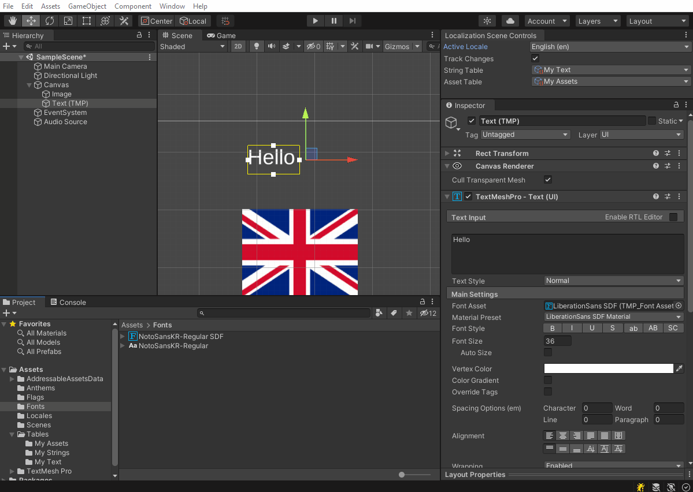

### Localize dynamic text

Unity can generate dynamic text using smart string. This example shows how to use multiple data sources to generate a string.

1. Open the String Table (menu: **Window > Asset Management > Localization Tables**).
2. Select **Add New Entry** button and give the new Entry a name.
3. Enable the **Smart** option to mark the entry as a [smart string](Smart/SmartStrings.md). This example uses the smart string reflection, global variables and plural features to print out a variable from the following script:

[!code-cs[apple-sample](../DocCodeSamples.Tests/Apples.cs)]

Enter the following values:

| **Locale** | **Translation** |
| -----------| --------------- |
| English    | {global.player-name} has {apple-component.appleCount:plural:an apple\|{} apples}        |
| French     | {global.player-name} a {apple-component.appleCount:plural:une pomme\|{} pommes}         |
| Spanish    | {global.player-name} tiene {apple-component.appleCount:plural:una manzana\|{} manzanas} |
| Japanese   | {global.player-name}は{apple-component.appleCount}個のリンゴを持っています                |

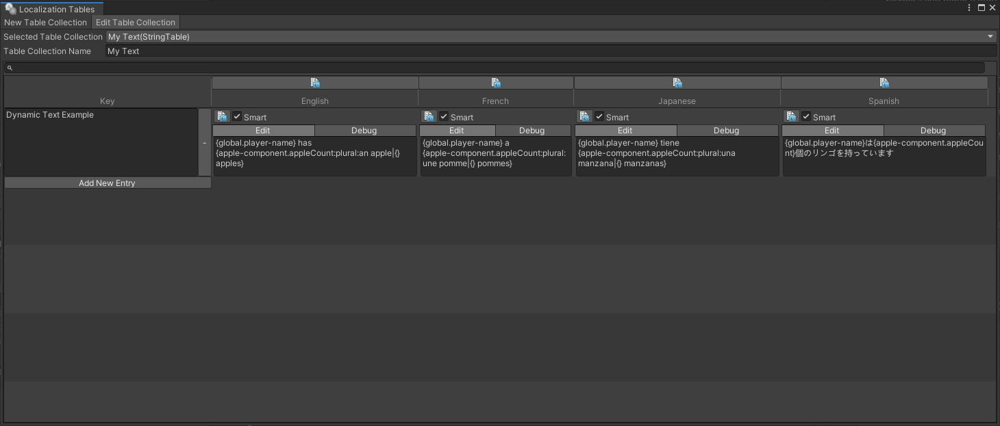

English, French and Spanish languages all use two plural forms in our example and Japanese does not use any plurals so we only need to insert the value.

### Use String Table entries

To add a UI Text element to the Scene, go to **GameObject > UI > Text**.

1. Right-click the Text component and select the **Localize** option. Unity adds a Localize String component and automatically configures it for the GameObject it is attached to. If the Text component contains a string value that is also in a String Table, then Unity automatically assigns this during the setup. If it does not, you can assign a value using the String Reference field dropdown. Assign the entry you previously created to the **String Reference**.
2. Add the **Apples** component to the same GameObject as the Text.
3. Press the Add (+) button in the **Local Variables** field, select **Object Reference** and drag the **Apples** Component into the **Object Reference** slot. Name the variable **apple-component**.

Note: if the Apples component is on a different GameObject then ensure that the component is dragged into the slot and not the GameObject reference. One way to do this is to open two inspectors and lock one of them to the Text; you can then drag the Component across from one inspector and into the other.

The Text and the 2nd Argument appleCount is now configured however we also need to configure the 1st argument {global.player-name}.

1. Create a Global Variables Group Asset (Menu: **Assets/Create/Localization/Global Variables Group**)
2. Select Add (+) in the Variables list and create a new String variable. Name it `player-name`.

    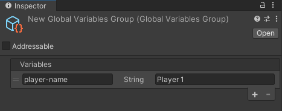

3. Open the Localization Settings (menu: **Edit > Project Settings > Localization**).
4. Navigate to the Smart Format Sources list (**String Database/Smart Format/**) and select Add (+) to create a new Global Variables Source. Drag and drop the Global Variables Source to the second position in the Sources List, under the List Formatter item.
5. Select Add (+) in the Global Variables Source to create a new item. Keep the default name “global”, this is the value used in the first part of the Smart String {**global**.player-name} and drag the Global Variables Source asset into the slot. The Global Variables source is now configured.

    

    Duplicate the Text GameObject and change the Apple count to a different value. Press Play and notice that the text is using the correct plural form for each.

    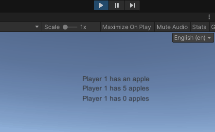

## Preview and configure your build

To use the localized assets in the player, you must build the Addressables player content. To do this, in the Addressables window (menu: **Window/Asset Management/Addressable Assets/Groups**), select **Build/New Build/Default Build Script**. You can also use the Addressables window to control how to repackage and host assets, such as local storage or via a remote web server.

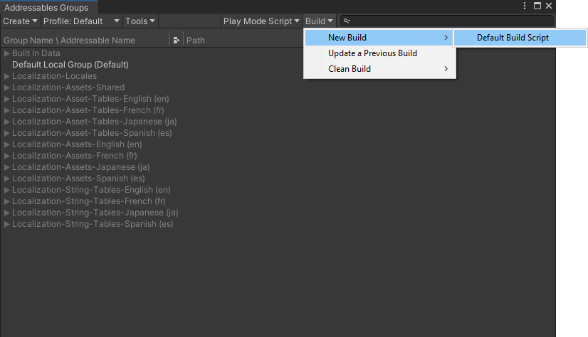
